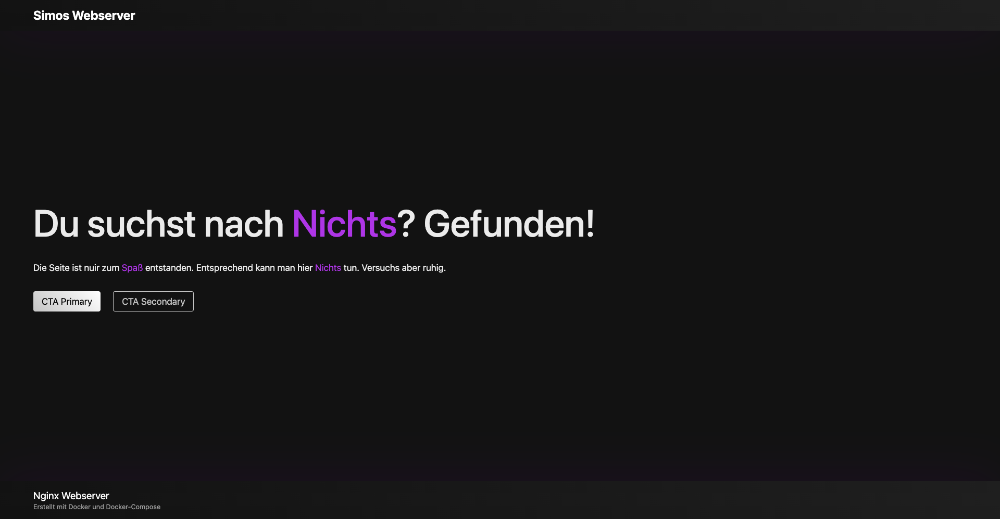

# Simple Web Server Container

Trying to understand the basics of Docker and Docker Compose I containerized a static Nginx Webserver which provides a static HTML:



Learnings:
- How to create a Dockerfile
- How to use base Images
- Port Mapping between host and container (8080:80)
- Multi Stage build
- How to use Docker Volumes for dynamic content

## Prerequisites

[Docker-Desktop](https://www.docker.com/products/docker-desktop/) needs to be installed on your machine.


## Installation

1. Clone the repository:
```bash
git clone https://github.com/Simo-Z/webserver-container.git
cd webserver-container
```

## Usage
To run the app simply run the docker compose up command in your terminal.
```bash
docker compose up -d
```

## License

MIT License

Copyright (c) [2025] [Simo Zilling]

Permission is hereby granted, free of charge, to any person obtaining a copy
of this software and associated documentation files (the "Software"), to deal
in the Software without restriction, including without limitation the rights
to use, copy, modify, merge, publish, distribute, sublicense, and/or sell
copies of the Software, and to permit persons to whom the Software is
furnished to do so, subject to the following conditions:

The above copyright notice and this permission notice shall be included in all
copies or substantial portions of the Software.

THE SOFTWARE IS PROVIDED "AS IS", WITHOUT WARRANTY OF ANY KIND, EXPRESS OR
IMPLIED, INCLUDING BUT NOT LIMITED TO THE WARRANTIES OF MERCHANTABILITY,
FITNESS FOR A PARTICULAR PURPOSE, AND NONINFRINGEMENT. IN NO EVENT SHALL THE
AUTHORS OR COPYRIGHT HOLDERS BE LIABLE FOR ANY CLAIM, DAMAGES, OR OTHER
LIABILITY, WHETHER IN AN ACTION OF CONTRACT, TORT, OR OTHERWISE, ARISING FROM,
OUT OF, OR IN CONNECTION WITH THE SOFTWARE OR THE USE OR OTHER DEALINGS IN THE
SOFTWARE.
